# wiki-hs-parser

Small CLI utility for Hearthstone Wiki pages, demonstrated with `C'Thun` and `Mountain Map`.

It extracts:

- the full infobox card data
- all art variants shown in the infobox
- direct image URLs for each art variant
- downloaded image files for each art variant
- related cards grouped by section
- generated card pools and the cards returned by each `Special:RunQuery/WikiCardPool` page
- artist, keywords, availability, voice actor, race, dbfId, and card id stats
- sound recordings from the `Sounds` section
- external links from the `External links` section
- `Patch changes` from the page

`related_cards` and `generated_cards` store `card_code` values such as `OG_281` and `CORE_ULD_723`.

## Requirements

- Python 3.13+
- `lxml`

Install dependencies:

```bash
pip install -r requirements.txt
```

## Usage

`C'Thun` example:

```bash
python wiki_hs_parser.py --page "https://hearthstone.wiki.gg/wiki/C%27Thun" --output-dir out/c-thun
```

`Mountain Map` example:

```bash
python wiki_hs_parser.py --page "https://hearthstone.wiki.gg/wiki/Mountain_Map" --output-dir out/mountain-map
```

Each run writes:

- `out/<slug>/result.json`
- `out/<slug>/result.md`
- `out/<slug>/patch-changes.md`
- `out/<slug>/arts/*`

## What You Get

The JSON output contains these top-level keys:

- `page_title`
- `page_url`
- `card_data`
- `infobox_fields`
- `arts`
- `related_cards`
- `generated_cards`
- `sounds`
- `external_links`
- `patch_changes`

Example card data for `C'Thun`:

| Field | Value |
| --- | --- |
| Name | `C'Thun` |
| Card id | `OG_280` |
| dbfId | `38857` |
| Class | `Neutral` |
| Card type | `Minion` |
| Cost | `8` |
| Attack | `6` |
| Health | `6` |
| Card set | `Whispers of the Old Gods` |
| Rarity | `Legendary` |
| Collectible | `true` |
| Non-collectible | `false` |
| Elite | `true` |
| Text | `Battlecry: Deal damage equal to this minion's Attack randomly split among all enemies.` |
| Battlecry | `true` |
| Artist | `James Ryman` |
| Keywords | `BATTLECRY` |
| Availability formats | `Wild` |
| Availability exclusions | `Default card generation` |
| Wiki mechanics | `Battlecry`, `Deal damage` |
| Wiki tags | `Attack-related`, `Random` |
| Flavor | `C'Thun's least favorite Hearthstone card: Eye for an Eye.` |
| Voice actor | `Michael Bell` |
| Race | `Old God` |

Normalized `card_data` excerpt:

```json
{
  "name": "C'Thun",
  "card_code": "OG_280",
  "dbf_id": 38857,
  "artist": "James Ryman",
  "full_text": "Battlecry: Deal damage equal to this minion's Attack randomly split among all enemies.",
  "battlecry": true,
  "keywords": ["BATTLECRY"],
  "rarity": "Legendary",
  "card_class": "Neutral",
  "card_type": "Minion",
  "cost": 8,
  "attack": 6,
  "health": 6,
  "card_set": "Whispers of the Old Gods",
  "collectible": true,
  "non_collectible": false,
  "elite": true,
  "availability": {
    "exclusions": ["Default card generation"],
    "formats": ["Wild"]
  },
  "wiki_mechanics": ["Battlecry", "Deal damage"],
  "wiki_tags": ["Attack-related", "Random"],
  "flavor": "C'Thun's least favorite Hearthstone card: Eye for an Eye.",
  "voice_actor": "Michael Bell",
  "race": "Old God"
}
```

## C'Thun Arts

The script extracts all three art variants from the infobox.

### Regular

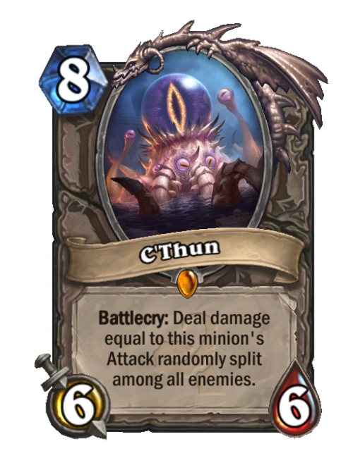

`OG_280`

### Golden

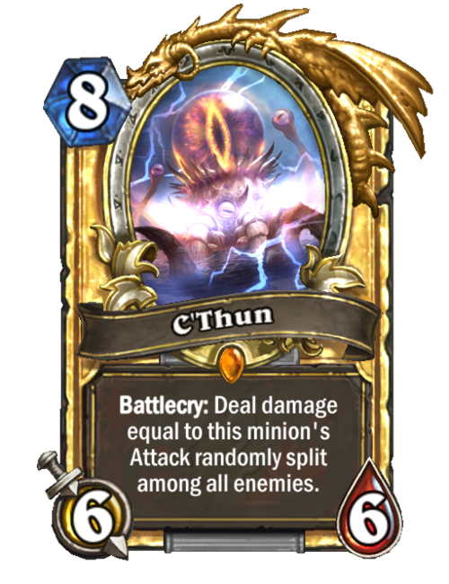

`OG_280`

### Signature

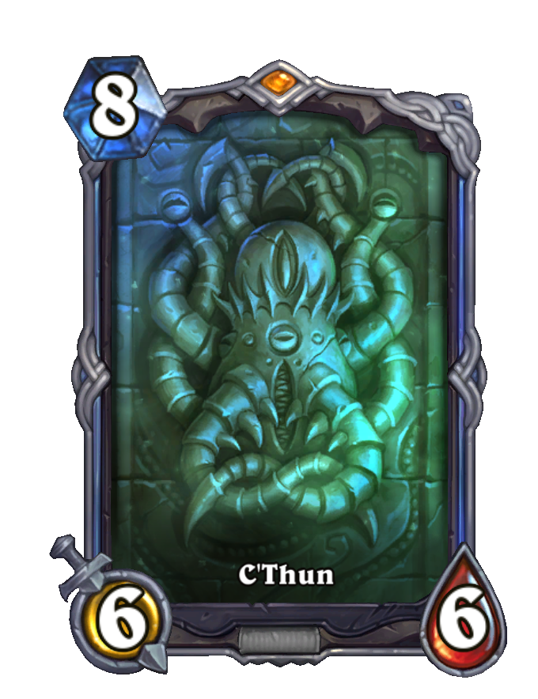

`OG_280`

### Stat Fields

The parser also keeps the smaller infobox stats that appear under the main card block:

- `keywords`: `BATTLECRY`
- `fullTags`: `RARITY=5 CLASS=12 COLLECTIBLE=1 ELITE=1 COST=8 HEALTH=6 ATK=6 CARDTYPE=4 BATTLECRY=1 2165=1 3076=1 1724=1 HAS_SIGNATURE_QUALITY=1 3633=1`
- `custom_mechanicTags`: `Battlecry , Deal damage`
- `custom_refTags`: `Attack-related , Random`
- `derived_exclusions`: `Default card generation`
- `derived_formats`: `Wild`
- `custom_voiceActor`: `Michael Bell`
- `custom_race`: `Old God`
- `dbfId`: `38857`
- `id`: `OG_280`

## C'Thun Related Cards

`Cards that improve C'Thun`

- `OG_281` Beckoner of Evil

  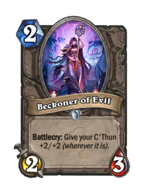

- `OG_303` Cult Sorcerer

  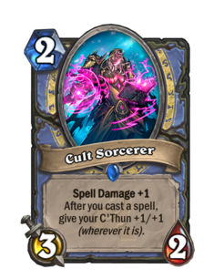

- `OG_284` Twilight Geomancer

  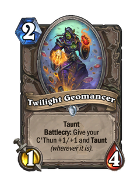

`Cards with C'Thun-related conditions`

- `WON_144` Eyestalk of C'Thun

  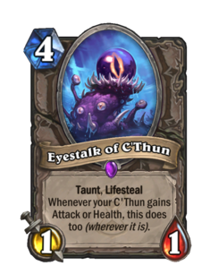

- `OG_188` Klaxxi Amber-Weaver

  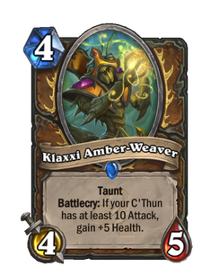

- `OG_131` Twin Emperor Vek'lor

  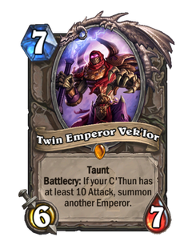

## Mountain Map Generated Cards

`Mountain Map` exposes a `Special:RunQuery/WikiCardPool` link, and the script follows it automatically.

- `CORE_ULD_723` Murmy (Core)

  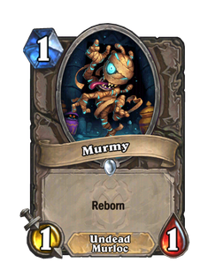

- `CORE_EX1_012` Bloodmage Thalnos (Core)

  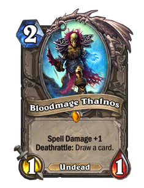

- `CORE_NEW1_020` Wild Pyromancer (Core)

  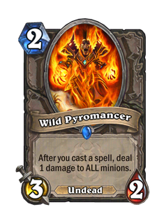

- `END_031` Shade of the End Time

  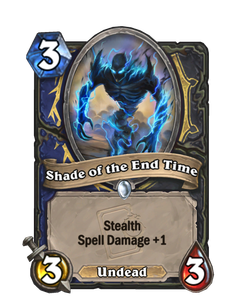

## C'Thun Sounds

The `Sounds` section is extracted as grouped audio clips. Each clip has a direct `file_url`, so it can be played from JSON or from the generated Markdown.

- `Play`
  - [`VO_OG_280_Male_OldGod_Play_01.wav`](https://hearthstone.wiki.gg/images/VO_OG_280_Male_OldGod_Play_01.wav?32ea16): `My dreaming ends... Your nightmare... begins.`
  - [`CThun_Play_Stinger.wav`](https://hearthstone.wiki.gg/images/CThun_Play_Stinger.wav?e61ea9): `<music stinger>`
- `Trigger`
  - [`VO_OG_280_Male_OldGod_InPlay_01.wav`](https://hearthstone.wiki.gg/images/VO_OG_280_Male_OldGod_InPlay_01.wav?78a6b0): `Your minions will abandon you.`
  - [`VO_OG_280_Male_OldGod_InPlay_02.wav`](https://hearthstone.wiki.gg/images/VO_OG_280_Male_OldGod_InPlay_02.wav?7429aa): `Death is close.`
  - [`VO_OG_280_Male_OldGod_InPlay_03.wav`](https://hearthstone.wiki.gg/images/VO_OG_280_Male_OldGod_InPlay_03.wav?e13a43): `Your deck betrays you.`
  - [`VO_OG_280_Male_OldGod_InPlay_04.wav`](https://hearthstone.wiki.gg/images/VO_OG_280_Male_OldGod_InPlay_04.wav?19167e): `You have already lost.`
  - [`VO_OG_280_Male_OldGod_InPlay_05.wav`](https://hearthstone.wiki.gg/images/VO_OG_280_Male_OldGod_InPlay_05.wav?3bed9f): `Caress your fear.`
  - [`VO_OG_280_Male_OldGod_InPlay_06.wav`](https://hearthstone.wiki.gg/images/VO_OG_280_Male_OldGod_InPlay_06.wav?5e3708): `Your minions think you are weak`
  - [`VO_OG_280_Male_OldGod_InPlay_07.wav`](https://hearthstone.wiki.gg/images/VO_OG_280_Male_OldGod_InPlay_07.wav?f5ab64): `Hope is an illusion.`
  - [`VO_OG_280_Male_OldGod_InPlay_08.wav`](https://hearthstone.wiki.gg/images/VO_OG_280_Male_OldGod_InPlay_08.wav?9a8378): `It was your fault.`
  - [`VO_OG_280_Male_OldGod_InPlay_09.wav`](https://hearthstone.wiki.gg/images/VO_OG_280_Male_OldGod_InPlay_09.wav?732793): `That was a mistake.`
  - [`VO_OG_280_Male_OldGod_InPlay_10.wav`](https://hearthstone.wiki.gg/images/VO_OG_280_Male_OldGod_InPlay_10.wav?9a1101): `Flee, screaming.`
  - [`VO_OG_280_Male_OldGod_InPlay_11.wav`](https://hearthstone.wiki.gg/images/VO_OG_280_Male_OldGod_InPlay_11.wav?a5d752): `Give in to your fear.`
  - [`VO_OG_280_Male_OldGod_InPlay_12.wav`](https://hearthstone.wiki.gg/images/VO_OG_280_Male_OldGod_InPlay_12.wav?95670b): `Well met.`
- `Attack`
  - [`VO_OG_280_Male_OldGod_Attack_01.wav`](https://hearthstone.wiki.gg/images/VO_OG_280_Male_OldGod_Attack_01.wav?f0f54e): `Sleep.`
- `Death`
  - [`VO_OG_280_Male_OldGod_Death_01.wav`](https://hearthstone.wiki.gg/images/VO_OG_280_Male_OldGod_Death_01.wav?d44bfc): `<death sound>`

## C'Thun External Links

- [PlayHearthstone](https://hearthstone.blizzard.com/cards/38857)
- [HSReplay.net](https://hsreplay.net/cards/38857)
- [Hearthpwn](https://www.hearthpwn.com/cards/31110)

## Notes

- The script uses the public MediaWiki API on `hearthstone.wiki.gg`.
- `C'Thun` is a good sanity check because it includes regular, golden, and signature art variants.
- `Mountain Map` is a good sanity check for generated card pools because it exposes a `Special:RunQuery/WikiCardPool` link.
- Art variants are resolved from the page's infobox, so regular, golden, signature, and other displayed variants are included when present.
